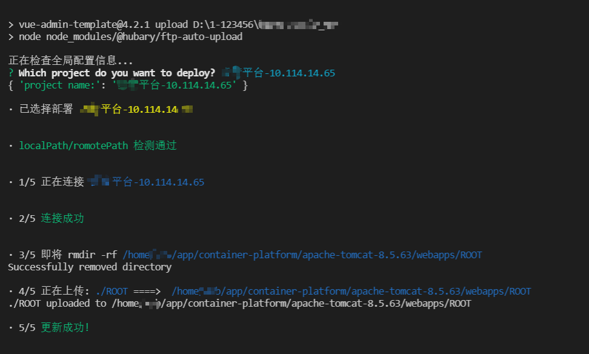

# ftp-auto-upload

## 介绍

一款提高刀耕火种时期部署前端代码效率的神器,参考自deploy,进行修改和添加数据操作反馈,以及路径检测

## 安装

```bash
npm install @hubary/ftp-auto-upload -D
```

## 使用

### 1. 项目根目录新建ftp.config.js文件进行服务器的信息配置(可从包内复制)

```javascript
module.exports = [
  {
    name: 'project-1-xxx',  // 项目1
    ssh: {
      host: '10.114.14.65',
      port: 22,
      username: 'test',
      password: '123456',
    },
    romotePath: '/home/front/dist',// 远程地址
    localPath: './dist',// 本地地址
    rootDir: 'dist',
    isTest: true, // 是否开启测试模式
  },
  {
    name: 'project-2-xxx',  // 项目2
    ssh: {
      host: '10.114.14.110',
      port: 22,
      username: 'test',
      password: '123456',
    },
    romotePath: '/home/front/dist',// 远程地址
    localPath: './dist',// 本地地址
    rootDir: 'dist',
    isTest: true, // 是否开启测试模式
  },
]

````

### 2 项目packages.json  script 添加

```json
{
  "scripts": {
    "upload": "node node_modules/@hubary/ftp-auto-upload"
  }
}
```

### 3 运行 `npm run upload` 即可`删除/更新`服务器指定位置代码


